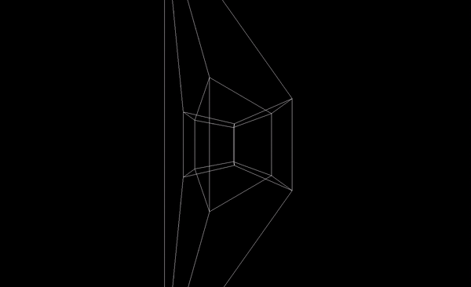

# 4D Hypercube (Tesseract) Visualization

This project provides a visualization of a 4D hypercube (tesseract) rotating in 3D space. The hypercube is rendered using the Three.js library and can be viewed in modern web browsers.

## Demo
i

## Getting Started

To run the project locally, follow these steps:

1. Clone the repository or download the source code.

2. Make sure you have a browserify tool installed globally. If not, you can install it using npm:

npm install -g browserify

3. Install the project dependencies by running the following command in the project directory:

npm install

4. Bundle the code using browserify:

browserify main.js -o bundle.js

5. Open the `index.html` file in a web browser to view the 4D hypercube visualization.

## Usage

The 4D hypercube rotates slowly around the XW plane, creating an intriguing 3D representation of a higher-dimensional object. You can interact with the visualization by:

- Zooming: Use the mouse scroll wheel to zoom in or out.

## Contributing

Contributions to the project are welcome! If you find any bugs or have suggestions for improvements, please open an issue or submit a pull request.

## License

This project is licensed under the [MIT License](LICENSE).
